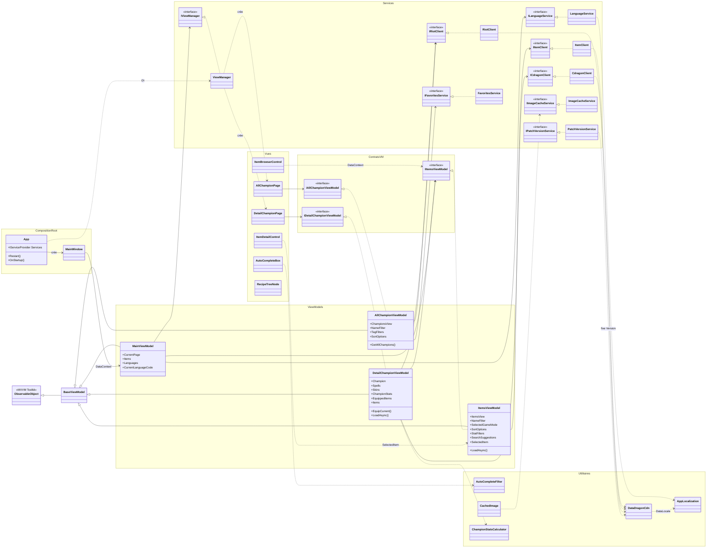
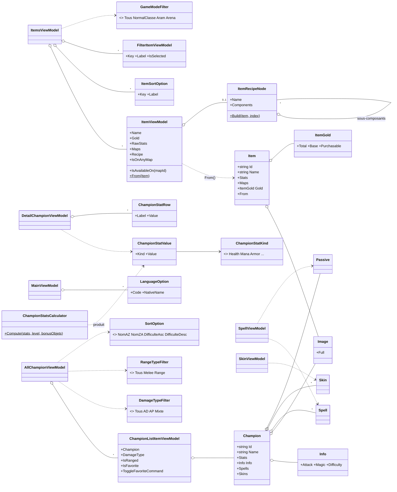
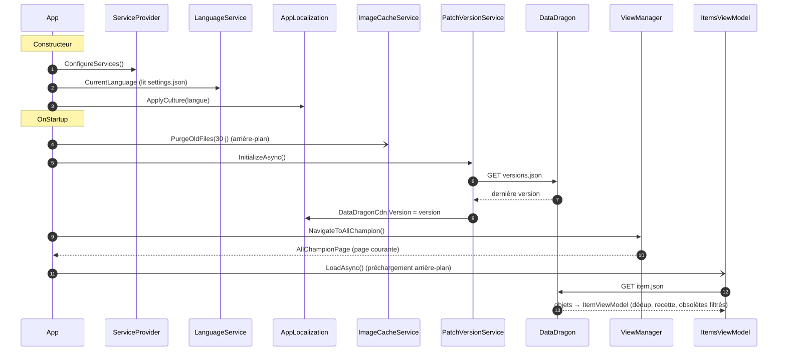
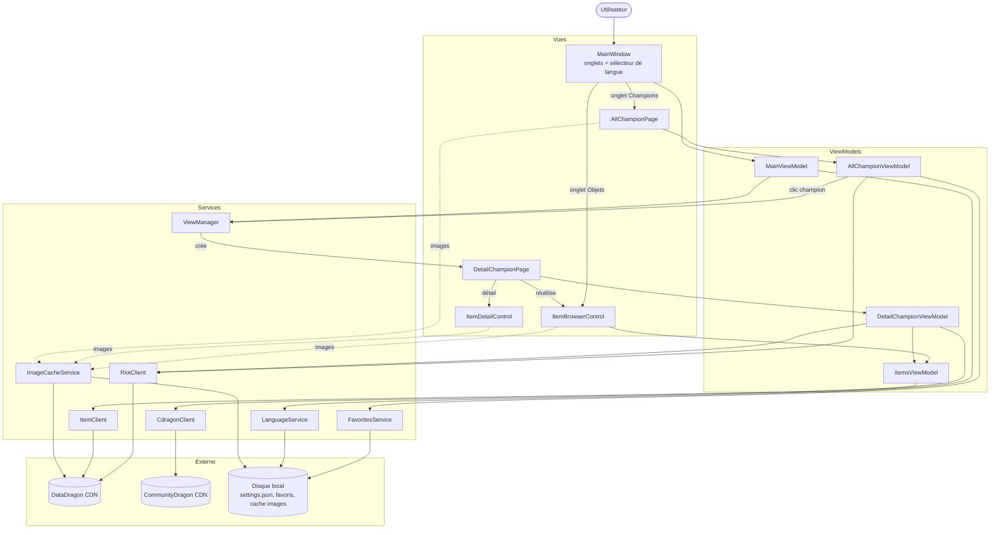
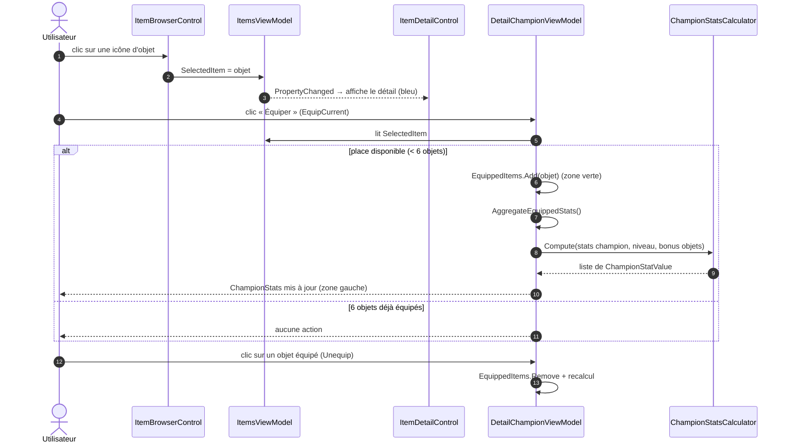
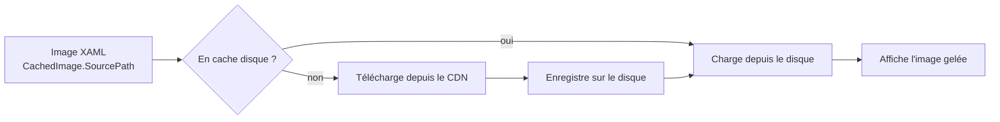

# LOLInfo — Diagrammes de l'application

Application **WPF (.NET)** suivant le patron **MVVM**, avec **injection de dépendances**
(`Microsoft.Extensions.DependencyInjection`) et une couche de services isolée derrière
des interfaces. Les données proviennent de deux CDN Riot (**DataDragon** et
**CommunityDragon**) et sont mises en cache sur le disque local.

- **Vues** (XAML) : ne contiennent que de la présentation + un mince code-behind.
- **ViewModels** : état et logique de présentation, exposés via des interfaces.
- **Services** : accès réseau (clients CDN), persistance locale (favoris, langue,
  cache d'images) et navigation.
- **Modèles** : DTO Riot/CDragon + logique de domaine (calcul de stats, recette).

> Les diagrammes ci-dessous sont en **Mermaid** (rendus par GitHub et l'aperçu VS Code).

---

## 1. Diagramme de classes — Architecture en couches

---

## 2. Diagramme de classes — Modèle de domaine

---

## 3. Diagramme de fonctionnement — Démarrage de l'application

---

## 4. Diagramme de fonctionnement — Navigation & flux de données

---

## 5. Diagramme de fonctionnement — Équiper un objet et recalculer les stats

Illustre la nouvelle interface partagée (onglet **Stats** du champion = même navigateur
d'objets que l'onglet **Objets**).

---

## 6. Pipeline d'affichage des images (cache)

---

### Notes de conception

- **Une seule instance partagée d'`ItemsViewModel`** (singleton DI) : l'onglet Objets
  et le navigateur de l'onglet Stats du champion partagent filtres et sélection.
- **`ItemBrowserControl` / `ItemDetailControl`** sont réutilisés aux deux endroits (DRY).
- **Changement de langue** : `LanguageService` persiste le choix, puis l'application
  **redémarre** (`App.Restart`) pour recharger l'UI et les données dans la nouvelle locale.
- **Dédup & obsolètes** : `ItemsViewModel` ne garde qu'une variante par nom selon le mode
  et masque les objets présents sur aucune carte (cf. `RebuildKeptIds`).
